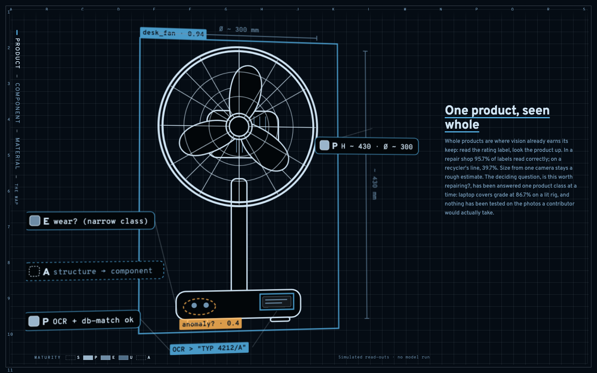

# What can a machine see? · CV × industrial ecology

[](https://github.com/simonvanlierde/cv-ie-taxonomy/actions/workflows/ci.yml)
[](https://simonvanlierde.github.io/cv-ie-taxonomy/)
[](LICENSE)
[](LICENSE-CONTENT)

An interactive map of the taxonomy in **Paper 2** (JIE Review). Explore which
computer-vision task recovers each product data type at each physical scale,
and how much to trust the result.

A self-contained React and TypeScript island that can run standalone or embed in
an Astro or Next portfolio.



**[▶ Open the live demo](https://simonvanlierde.github.io/cv-ie-taxonomy/)**

## What it does

An end-of-life **desk fan** comes apart as you scroll through three physical
scales: **Product → Component → Material**. The fan shows common computer-vision
outputs:

- detection boxes for Identity
- segmentation masks for Structure
- OCR for the rating label
- dimension call-outs for Quantity
- anomaly tags for Condition
- material tags at the Material scale

Use the annotation chips to inspect each taxonomy cell. Hover to isolate a cell.
Click to open its task, verdict, failure mode, example, rubric marks, and sources.
Use arrow keys to move between cells and filter chips to narrow the view.

On mobile, the narrative uses full-screen pages with a fold-away peek sheet.

The final screen shows the complete 3 × 4 matrix. Every cell remains clickable,
and a **Plain table** button exposes the same data as a table. Structurally empty
Hatching marks empty cells with no verdict. No task-level cell reaches Strong under
end-of-life capture.

## Data is the source of truth

[`src/data/taxonomy.json`](src/data/taxonomy.json) mirrors **Table S2**: twelve
cells, five-level maturity verdicts, rubric marks, failure modes, examples, and
citation keys. Ten cells carry a task; the two structurally empty Structure cells
do not.

[`src/data/taxonomy.test.ts`](src/data/taxonomy.test.ts) enforces the invariants
that break if the JSON drifts from the paper.

## Accessibility

Maturity uses ink weight and letters, not colour: S is darkest, U is lightest,
and A is hollow for no data.

Textures preserve the ranks in `forced-colors` mode and print: solid = S, diagonal
hatch = P, dots = E, ring = U, and dashed hollow = A.

Colour indicates physical scale. The triad uses the colourblind-safe Okabe–Ito
palette, with material tints for copper, steel, ABS, and PCB.

Segmentation masks and boxes include class labels, so identity does not depend on
colour. Their hues follow COCO/YOLO conventions and adapt to the theme.

SVG read-outs, matrix cells, and mobile rows are keyboard-operable controls with
accessible labels. The detail view is a dialog that closes with `Esc`.

`prefers-reduced-motion` disables the idle spin and scroll smoothing. The island
follows the colour scheme, or the host can force a theme.

## Develop

```sh
pnpm install
pnpm dev         # http://localhost:5173
pnpm test        # data + interaction tests, jsdom (vitest)
pnpm build       # typecheck + production build
```

Tests split into two Vitest projects. `pnpm test` runs `unit` in jsdom, fast
enough for the inner loop. `pnpm test:browser` runs `browser` in real
Chromium, for the handful of contracts jsdom can't honour — a dialog's focus
restore, `inert`, the top layer, real `ResizeObserver` layout. `pnpm
test:all` runs both; CI does.

Demo deep links: `?cell=component-structure` opens a detail, `?theme=dark|light`
forces a theme, and `?p=0.56` pins scroll progress for screenshots.

## Embed as an island

```astro
---
import { CvTaxonomy } from "cv-ie-taxonomy-viz";
---
<CvTaxonomy client:visible />
```

Optional props: `theme: "light" | "dark"` forces a theme over the media-query
default; `initialCell: string` opens a cell's detail on load.

## Assumptions

- The desk fan is a representative WEEE product. The taxonomy is product-general,
  with evidence from washing machines, laptops, smartphones, and vehicles.
- Overlay numbers are **mock values** that illustrate each technique's output.
  Verdict letters come from the paper.
- The fan drawing is schematic, not to scale.
- Verdicts are a **June 2026 snapshot**. The taxonomy structure is the durable
  contribution.

## License

Split so the software is freely reusable while the research stays citable:

- **Code**: [MIT](LICENSE).
- **Taxonomy data** (`src/data/taxonomy.json`, mirroring Table S2), **figures, and
  content**: [CC BY 4.0](LICENSE-CONTENT).
