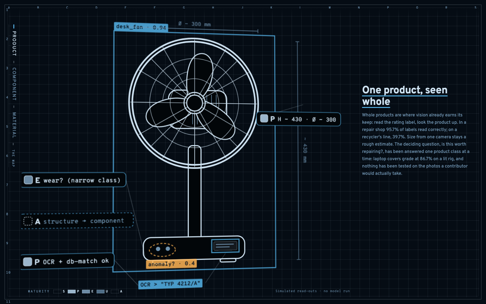

# What can a machine see? · CV × industrial ecology

[](https://github.com/simonvanlierde/cv-ie-taxonomy/actions/workflows/ci.yml)
[](https://simonvanlierde.github.io/cv-ie-taxonomy/)
[](LICENSE)
[](LICENSE-CONTENT)

An interactive map from the review article *Benchmarked, Rarely Field-Tested:
Computer Vision for End-of-Life Product Data in Industrial Ecology* (van Lierde
et al., [citation: forthcoming]). It shows what cameras and image software
(computer vision) can tell about a used product, and how far you can trust each
answer.

The page is a self-contained React and TypeScript component. It runs on its own
or inside an Astro or Next site.



**[▶ Open the live demo](https://simonvanlierde.github.io/cv-ie-taxonomy/)**

## What it does

A worn-out **desk fan** comes apart as you scroll. It goes through three
physical scales: **Product → Component → Material**. Along the way, the fan
shows the kinds of output computer vision produces:

- boxes around detected parts, for Identity
- outlines of each part (segmentation masks), for Structure
- text read off the rating label (OCR)
- measurements, for Quantity
- flags on possible damage, for Condition
- material labels, at the Material scale

These read-outs are simulated. No model was run on the drawing.

Each label on the fan opens one cell of the map. Hover over a label to pick out
its cell. Click it to see the task, the verdict, where it fails, an example, the
rubric marks and the sources. With a detail open, the arrow keys step to the
next cell: within the scale on the fan, or across the whole map at the end.

On a phone, the story runs as full-screen pages with a sheet that folds away.

The last screen shows all twelve cells as a 3 × 4 grid. Every cell can be
clicked, and a **Plain table** button shows the same data as a table. Hatching
marks the two structurally empty cells, which have no verdict. No task reaches
Strong under end-of-life capture.

## Data is the source of truth

[`src/data/taxonomy.json`](src/data/taxonomy.json) mirrors **Table S2**: twelve
cells, five-level maturity verdicts, rubric marks, failure modes, examples, and
citation keys. Ten cells carry a task; the two structurally empty Structure cells
do not.

[`src/data/taxonomy.test.ts`](src/data/taxonomy.test.ts) enforces the invariants
that break if the JSON drifts from the paper.

## Accessibility

Maturity uses ink weight and letters, not colour: S is darkest, U is lightest,
and A is hollow for no data.

Textures preserve the ranks in `forced-colors` mode and print: solid = S, diagonal
hatch = P, dots = E, ring = U, and dashed hollow = A.

Colour indicates physical scale. The triad uses the colourblind-safe Okabe–Ito
palette, with material tints for copper, steel, ABS, and PCB.

Segmentation masks and boxes include class labels, so identity does not depend on
colour. Their hues follow COCO/YOLO conventions and adapt to the theme.

SVG read-outs, matrix cells, and mobile rows are keyboard-operable controls with
accessible labels. The detail view is a dialog that closes with `Esc`.

`prefers-reduced-motion` disables the idle spin and scroll smoothing. The island
follows the colour scheme, or the host can force a theme.

## Develop

```sh
pnpm install
pnpm dev         # http://localhost:5173
pnpm test        # data + interaction tests, jsdom (vitest)
pnpm build       # typecheck + production build
```

Tests split into two Vitest projects. `pnpm test` runs `unit` in jsdom, fast
enough for the inner loop. `pnpm test:browser` runs `browser` in real
Chromium, for the handful of contracts jsdom can't honour — a dialog's focus
restore, `inert`, the top layer, real `ResizeObserver` layout. `pnpm
test:all` runs both; CI does.

Demo deep links: `?cell=component-structure` opens a detail, `?theme=dark|light`
forces a theme, and `?p=0.56` pins scroll progress for screenshots. Cell ids are
`<scale>-<information type>` in lower case, e.g. `material-quantity`; invalid
values are ignored.

Requires Node 26 or later. `pnpm test:browser` needs Chromium once:
`pnpm exec playwright install chromium`. CI also runs `pnpm check` (Biome) and
`pnpm check:theme`; after editing `src/theme.ts`, run `pnpm gen:theme`.

## Embed as an island

The package is not published. Copy `src/` (without the tests) into the host
project and import the component; it imports its own stylesheet and fonts, so the
host bundler needs to handle CSS and `.woff2` imports.

```astro
---
import { CvTaxonomy } from "../cv-ie-taxonomy/CvTaxonomy";
---
<CvTaxonomy client:visible />
```

Optional props: `theme: "light" | "dark"` forces a theme over the media-query
default; `initialCell: string` opens a cell's detail on load. `debugProgress` is
for development only.

## Assumptions

- The desk fan is a representative WEEE product. The taxonomy is product-general,
  with evidence from washing machines, laptops, smartphones, and vehicles.
- Overlay numbers are **mock values** that illustrate each technique's output.
  Verdict letters come from the paper.
- The fan drawing is schematic, not to scale.
- Verdicts are a **June 2026 snapshot**. The taxonomy structure is the durable
  contribution.

## License

Split so the software is freely reusable while the research stays citable:

- **Code**: [MIT](LICENSE).
- **Taxonomy data** (`src/data/taxonomy.json`, mirroring Table S2), **figures, and
  content**: [CC BY 4.0](LICENSE-CONTENT).
